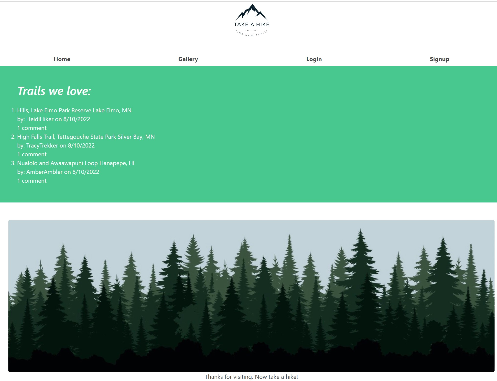
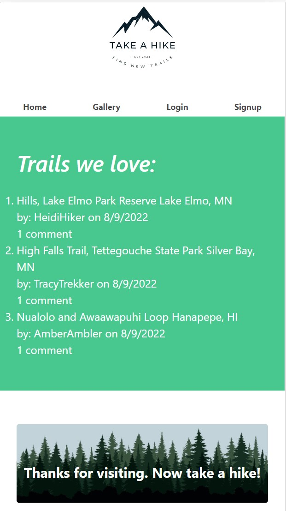

# Take a Hike

## This is a web application for users to post their thoughts on all things about hiking trails. The app is located on Heroku at [https://takea-hike.herokuapp.com/](https://takea-hike.herokuapp.com/).

## Table of Contents:

- [Installation](#installation)
- [Usage](#usage)
- [Screenshots](#screenshots)
- [License](#license)
- [Collaborators](#collaborators)
- [Contributing](#contributing)
- [Testing](#tests)
- [Questions](#questions)

## Installation

Clone the repository from [GitHub](https://github.com/willig0203/Take-A-Hike) onto your machine in a local folder. This program will require Node.js and MySQL. Install node.js: [Installation Guide](https://coding-boot-camp.github.io/full-stack/nodejs/how-to-install-nodejs). Install MySQL: [Installation Guide](https://coding-boot-camp.github.io/full-stack/mysql/mysql-installation-guide). From the root of the project folder do an npm (Node Package Manager) install to get the package dependencies (type `npm install` on the command line). Dependencies used are: bcrypt, bulma, cloudinary, connect-session, connect-session-sequelize, dotenv, express, express-handlebars, express-session, express-session-sequelize, jest, mysql, mysql2, and sequelize.

## Usage

Step one: From the command line enter into MySQL using the command `mysql -u root -p` and then enter your password. Step two: Enter `source db/schema.sql` to initialize the database. Exit MySQL. Step three (optional): Seed the database using the command: `npm seeds` or `node seeds/index.js`. Step four: Enter `npm start` or `node server.js` to start the server. Step five: Enter localhost:3001 in your browser. Voila!

OR

Use the live app on Heroku: [https://taka-hike.herokuapp.com/](https://takea-hike.herokuapp.com/)

## Screenshots

  
  <em>Computer</em>

  
  <em>Mobile Device</em>

## License

&copy; 2022 by Take a Hike.
This project is licensed under the MIT license.
https://opensource.org/licenses/MIT

## Collaborators:

Amy McCabe, Michael Atwood, Mitchel Eide, Gary Williams

## Contributing

To contribute to this project please make a new issue or pull request.

## Tests

Follow the usage instructions for seeding the project.

## Questions

Contact Amy McCabe at: [mcca0168@umn.edu](mailto:mcca0168@umn.edu) or [GitHub](https://github.com/McAmy2001/)
